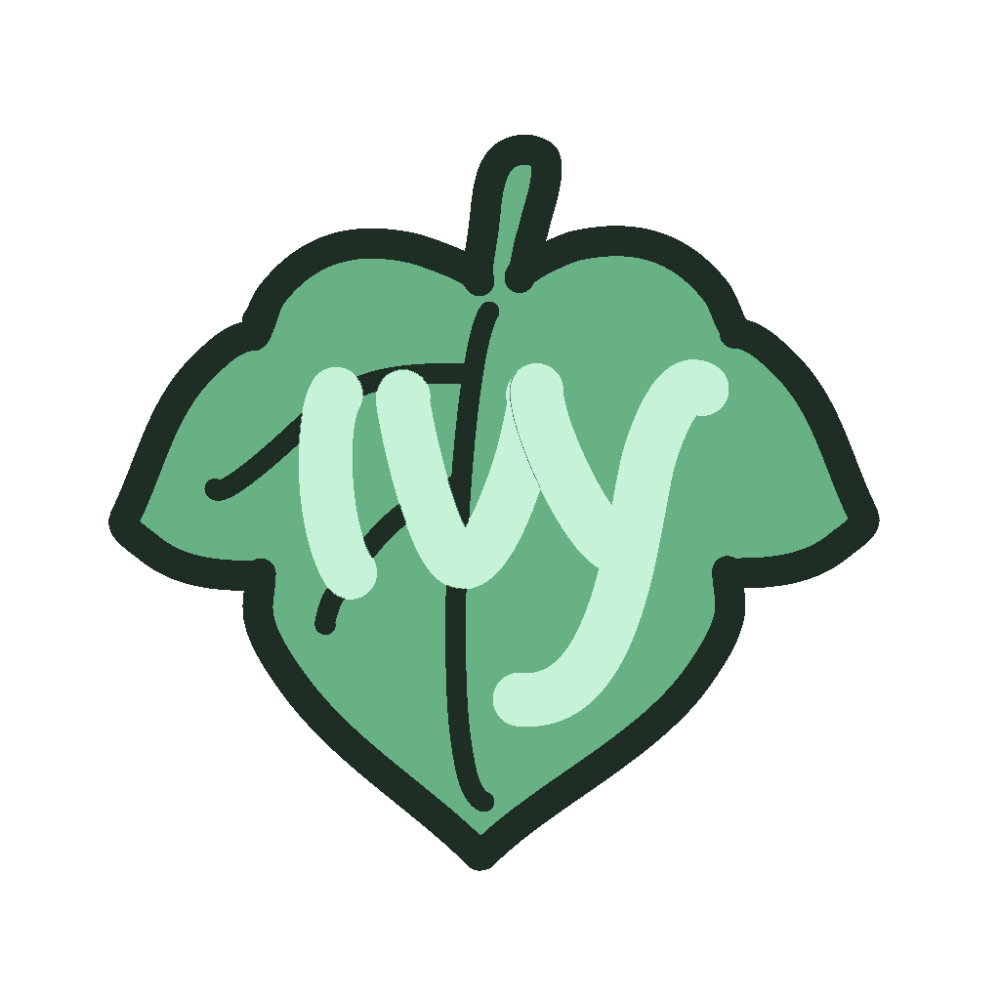

# ivy



> interpreter for the ivy :herb: programming language

---
ivy :herb: is a programming language I'm working on as an introduction to interpreters. It's a simple language and was heavily inspired by the [Lisp](https://en.wikipedia.org/wiki/Lisp_(programming_language)) family of languages so there's (a lot of (parenthesis)).

This project is still a work in progress and is mostly meant to be for educational purposes so that I can get experience designing and implementing a language from scratch. With that being said, I plan on continously improving various parts of the interpeter as I learn more.

## Installation
Make sure you have [go](https://golang.org/) installed.

```bash
$ go get https://github.com/gtr/ivy
$ cd $GOPATH/src/github.com/gtr/ivy/
$ go build
$ ./ivy file [options]
```
## Usage
```
Usage:
 ivy file [options]

 file       the file containing ivy source code;
            starts the ivy REPL if not specified
Options:
 -t, --tree	prints a syntax tree of the source code
 -h, --help	prints this message
```

There are several examples in the `examples/` folder so you can try them by running:
```
$ ./ivy examples/area.ivy
```

## The Basics

Like other Lisps, ivy uses prefix notation. So, instead of `3 + 7`, you would write `+ 3 7` in ivy.

```python
(program    # Each ivy program starts with the `program` keyword

    # Bind values to symbols with the `def` keyword
    (def radius 3)

    # You can ommit the `()` and use newlines as delimeters like this:
    def radius_two 3

    # You can define functions in several ways:
    # Using `def` and `lambda`
    def square (lambda [x] (* x x))
    # Or using `defn` which is equivalent to the above
    defn circle_area [r] (* 3.14 (square r))

    # Call the function and print the result:
    # Prints: 28.260
    println (circle_area radius)

    # There's also immutable maps:
    (def hot_house { 
        # @key     value
        @title     "Hot House"
        @artist    "Arturo Sandoval"
        @genres    ["jazz" "latin jazz"]
        @year      1998
    })

    # Prints: ["jazz" "latin jazz"]
    println (hot_house @genres) 

)
```

## Demo

Here's a small demo of `fib`, a function returning the `n-th` number in the fibonacci sequence using pattern-matching and recursion.

```python
(program

    defn fib [0] (0)    # Base case
    defn fib [1] (1)    # Base case
    # Recursive case
    defn fib [n] (+ (fib (- n 2)) (fib (- n 1)))

    def a (fib 6)
    def b (fib 3)

    println "fib(6)=" a
    println "fib(3)=" b

)
```

This prints:
```
fib(6)=8
fib(3)=2
```

## What's next?

The highest priority at the moment is adding macros to ivy. One of the future updates will be to make ivy statically-typed but I'm still investigating that possibility I'm also strongly considering re-writing this project in Rust.

## Credits

Author: Gerardo Torres ([github.com/gtr](https://github.com/gtr))

Logo design: Emily Zhao ([morningsbell.carrd.co/](https://morningsbell.carrd.co/))

## License

GNU General Public License